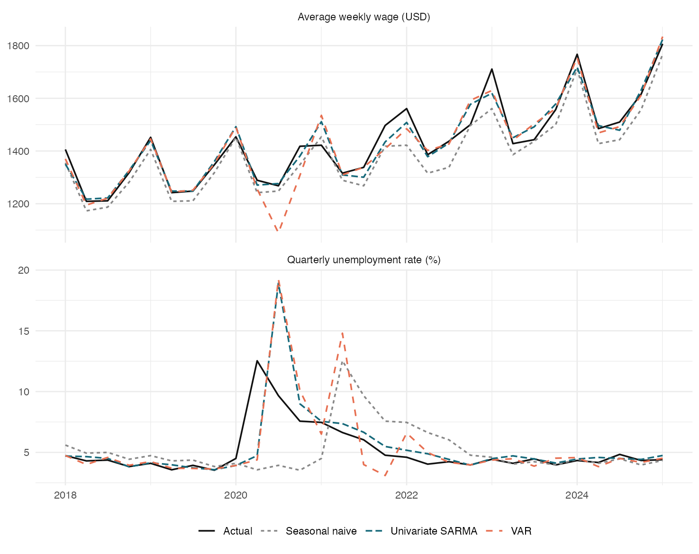

# Houston Labour-Market Time Series

A corrected portfolio reanalysis of quarterly Houston-area unemployment and
average weekly wages from 1990 Q1 through 2025 Q1.

The project asks whether a joint two-series model improves one-quarter-ahead
forecasts over separate seasonal ARMA models and a simple seasonal-naive
baseline. It is a forecasting comparison, not a causal claim about wages and
unemployment.



## Main result

Across a 29-quarter expanding-window evaluation from 2018 Q1 through 2025 Q1,
the separate univariate models had the lowest RMSE for both targets:

| Target | Univariate SARMA | Seasonal naive | VAR |
|---|---:|---:|---:|
| Unemployment rate | 2.29 pp | 2.73 pp | 2.91 pp |
| Average weekly wage | $39.32 | $61.36 | $57.42 |

The univariate models also had the lowest MAE. This result says only that the
fitted VAR did not improve point forecasts in this particular historical
evaluation. It does not prove that the two variables are unrelated. The
evaluation includes the exceptional COVID-19 labour-market shock, so the error
metrics should not be generalized mechanically. The selected wage model's
initial residual check is also borderline (Ljung–Box p-value about 0.052), so it
should not be presented as a final production model.

## What was corrected

- Treated `HOUS448URN` as a **monthly unemployment rate**, then averaged all
  three months within each quarter.
- Treated `ENUC264240010` as **quarterly average weekly wages in dollars**, not
  minimum wage and not millions of dollars.
- Joined the series by actual quarter instead of recycling unequal vectors.
- Used a four-quarter seasonal difference, never a 12-quarter lag, for annual
  comparisons in quarterly data.
- Used ADF and KPSS tests as complementary diagnostics and interpreted the
  Ljung–Box test correctly as a residual-autocorrelation check—not a
  stationarity test.
- Selected univariate candidates on the initial training sample, requiring a
  12-lag Ljung–Box p-value of at least 0.05 before comparing AICc.
- Compared every model with the same expanding-window, one-quarter-ahead
  forecast design.
- Added a seasonal-naive baseline, fixed data cutoff, reproducible outputs,
  limitations, and a detailed change log.

See [`CHANGES.md`](CHANGES.md) for the complete list.

## Data

The frozen snapshot contains 141 aligned quarters from 1990 Q1 through 2025
Q1. Both source series are not seasonally adjusted:

- [FRED HOUS448URN](https://fred.stlouisfed.org/series/HOUS448URN): monthly
  unemployment rate, percent.
- [FRED ENUC264240010](https://fred.stlouisfed.org/series/ENUC264240010):
  quarterly average weekly wages, dollars per week.

See [`data/README.md`](data/README.md) for frequency alignment, provenance, and
revision caveats.

## Reproduce

From the repository root:

```bash
Rscript run.R
```

Required packages are `forecast`, `ggplot2`, `knitr`, `rmarkdown`, `tseries`,
and `vars`. The command reruns model selection, the rolling evaluation, all
tables and figures, and the self-contained HTML report.

The committed snapshot makes this command deterministic with respect to the
input data. To intentionally re-download the FRED series while retaining the
fixed 2025 Q1 cutoff, run this first:

```bash
Rscript R/download_data.R
```

Main report: [`report/analysis.html`](report/analysis.html).

## Repository structure

```text
.
├── R/                       Data refresh, helpers, and analysis pipeline
├── data/raw/                Frozen FRED downloads
├── data/processed/          Aligned quarterly snapshot and metadata
├── figures/                 Reproducible figures
├── report/analysis.Rmd      Portfolio report source
├── report/analysis.html     Self-contained rendered report
├── results/                 Model rankings, diagnostics, and forecasts
├── CHANGES.md               Full correction list
└── run.R                    One-command local rebuild
```

## Portfolio context and attribution

The earlier two-part submission was a collaborative MAT 3379 course project by
Reway Du and three peers. The archived files do not contain a task-level
contribution table, so this repository does not claim that Reway solely authored
any specific original section. This portfolio edition is a post-course rewrite
that preserves the topic while replacing the flawed analysis and omitting
student numbers, assignment prompts, and teammate names.

OpenAI Codex assisted with the post-course statistical refactor, code,
documentation, and testing. Reway should run the project personally and be able
to explain every transformation, diagnostic, model, and limitation before
linking it on a résumé. Confirm any teammate or instructor permission required
before making the repository public.
